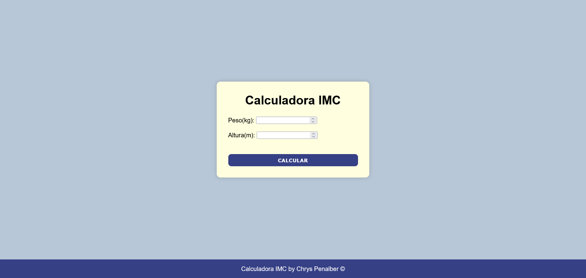

[Versão em Português](#portugues) | [English Version](#english)

---

#  Calculadora IMC | Desenvolvido por Chrys Penalber

Este projeto é uma **calculadora interativa de IMC (Índice de Massa Corporal)** desenvolvida com **HTML, CSS e JavaScript**.  
A aplicação permite que o usuário insira peso e altura para calcular automaticamente o IMC e exibir sua classificação de acordo com as faixas recomendadas pela **OMS**.

---

## 📸 Preview

🔗 **Links**

🔴 [Live Site](https://chryspenalber.github.io/tarefa-4/)  
💻 [Repositório no GitHub](https://github.com/chryspenalber/tarefa-4)

---

## 📐 Visão Geral

A página foi desenvolvida para praticar fundamentos de **JavaScript aplicado ao DOM**, **estruturas condicionais** e **responsividade básica com CSS**.  
O funcionamento é simples: o usuário digita o peso e a altura, clica em **“Calcular”**, e o resultado é exibido imediatamente na tela.

### ⚙️ Funcionalidades

* Entrada de peso e altura com validação simples  
* Cálculo automático do IMC  
* Exibição dinâmica da classificação:
  * Abaixo do peso  
  * Peso normal  
  * Sobrepeso  
  * Obesidade  
* Interface centralizada e agradável  
* Rodapé com créditos personalizados  

---

## 🛠️ Tecnologias Utilizadas

* **HTML5** — Estrutura da calculadora  
* **CSS3** — Estilização e layout centralizado com `flexbox`  
* **JavaScript (ES6)** — Cálculo, manipulação do DOM e exibição de resultados  

---

## 📲 Responsividade

A página adapta-se a diferentes tamanhos de tela, mantendo boa legibilidade e usabilidade.  
Técnicas aplicadas:

* Layout centralizado com `flexbox`  
* Largura fluida do container principal  
* Fonte legível e espaçamento proporcional  

---

## 💡 O que foi explorado neste projeto

* Manipulação do DOM com `getElementById()`  
* Estruturas condicionais (`if`, `else if`, `else`)  
* Conversão de tipos com `Number()`  
* Cálculo matemático simples com operadores aritméticos  
* Organização de código e separação de responsabilidades (HTML, CSS e JS)  

---

## 🧠 Melhorias Futuras

* Adicionar validação de campos vazios  
* Exibir mensagens de erro para valores incorretos  
* Incluir uma barra de progresso visual para o resultado  
* Implementar versão com **Dark Mode 🌙**

---

## 👩‍💻 Autora

* GitHub — [@chryspenalber](https://github.com/chryspenalber)  
* LinkedIn — [Chrystiana Penalber](https://www.linkedin.com/in/chrystiana-penalber/)

---

#  BMI Calculator | Developed by Chrys Penalber

[Versão em Português](#portugues)

This project is an **interactive BMI (Body Mass Index) calculator** built with **HTML, CSS, and JavaScript**.  
The application allows users to enter their weight and height to automatically calculate their BMI and display the corresponding classification based on the **World Health Organization (WHO)** standards.

---

## 📸 Preview

🔗 **Links**

🔴 [Live Site](https://chryspenalber.github.io/tarefa-4/)  
💻 [GitHub Repository](https://github.com/chryspenalber/tarefa-4)

---

## 📐 Overview

This page was developed to practice **JavaScript fundamentals**, including **DOM manipulation**, **conditional structures**, and **basic responsive design with CSS**.  
The functionality is simple: the user enters their weight and height, clicks **“Calculate”**, and the result is displayed instantly on the screen.

### ⚙️ Features

* Input fields for weight and height with basic validation  
* Automatic BMI calculation  
* Dynamic display of BMI classification:
  * Underweight  
  * Normal weight  
  * Overweight  
  * Obesity  
* Clean and centered interface  
* Personalized footer with author credits  

---

## 🛠️ Technologies Used

* **HTML5** — Page and calculator structure  
* **CSS3** — Styling and layout using `flexbox`  
* **JavaScript (ES6)** — BMI logic, DOM manipulation, and result display  

---

## 📲 Responsiveness

The layout adapts to different screen sizes, ensuring good readability and usability.  
Techniques applied:

* Centered layout using `flexbox`  
* Fluid container width  
* Readable typography and proportional spacing  

---

## 💡 What Was Practiced in This Project

* DOM manipulation with `getElementById()`  
* Conditional logic (`if`, `else if`, `else`)  
* Type conversion using `Number()`  
* Basic mathematical operations with arithmetic operators  
* Clean code structure and separation of concerns between HTML, CSS, and JS  

---

## 🧠 Future Improvements

* Add empty-field validation  
* Display error messages for invalid inputs  
* Include a visual progress bar for BMI range  
* Implement a **Dark Mode 🌙** version  

---

## 👩‍💻 Author

* GitHub — [@chryspenalber](https://github.com/chryspenalber)  
* LinkedIn — [Chrystiana Penalber](https://www.linkedin.com/in/chrystiana-penalber/)
